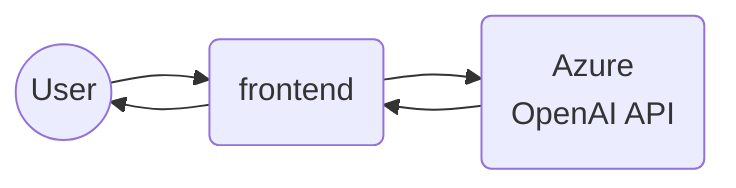
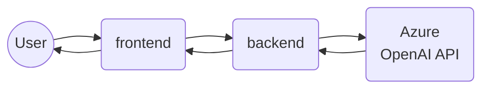

# Azure OpenAI Demo

Three Azure OpenAI demo that includes the ability to generate product description, city travel guides, and includes a playground area for setting context and prompting. It also includes a static content generator for the city guide content that is generated dynamically.

## Requirements

- Azure Subscription
  - Access to the OpenAI Services
    - A Davinci deployment
    - A Gpt 3.5 turbo deployment
    - An API KEY for the deployments
- node and npm
- Go 1.20

## Demo Areas

The demo is meant to serve as a simulator to help you understand how to use the Azure OpenAI API could be leverage to build a variety of applications. The demo is broken into three areas:

## Ask Me Anything

This demo a playground for you to try out different prompts and see how the API responds. You can also set the context from text or scrapping a web site. The idea of this demo it to help the user understand how to set context when ChatGPT generates a completion from a prompt. This demo leverages the Azure GPT 3.5 endpoint.

## Product Description Generator

This demo will mock requesting a list of electronic consumer products, and the generating sales descriptions for the same. This demo leverages the Davinci endpoint.

## City Guides

This demo will mock building a travel guide for a city. The city guide is built by selecting from a list of cities or dynamically based on the city name that is entered. This demo leverages the Davinci endpoint. You can add more cities to the list by modifying the `openai-demos/public/data/list.json`. For the attraction images, I did not want to use images that I did not own. Only Rio de Janeiro has images.

## Static Generator

This demo will build the static content for City Guides as a backend process using the Davinvi endpoint. This content could be used in static content generators such as Jekyll or Hugo to generate a full site.

## Stack

### Frontend

```text
"dependencies": {
    "axios": "^1.3.5",
    "bootstrap": "^5.2.3",
    "bootstrap-icons": "^1.10.4",
    "react": "^18.2.0",
    "react-dom": "^18.2.0",
    "react-markdown": "^8.0.6",
    "react-router-dom": "^6.10.0"
  }
```

### Backend: Go 1.20

```text
require (
	github.com/anaskhan96/soup v1.2.5
	github.com/gofiber/fiber/v2 v2.43.0
	github.com/joho/godotenv v1.5.1
	github.com/sirupsen/logrus v1.9.0
)
```

### Static Generation Job: Go 1.20

```text
require (
	github.com/go-gota/gota v0.12.0
	github.com/sirupsen/logrus v1.9.0
	github.com/subosito/gotenv v1.4.2
)
```

## Running the demo

### Running the demo directly from React

> Note: This demo can run directly from React

- Change directory to: `openai-demo`
- Type: `npm install`
- Create or edit an `.env` file and add the following values:

```bash
VITE_OPENAI_GPT_URL=<AZURE_GPT_ENDPOINT>
VITE_OPENAI_DAVINCI_URL=<AZURE_GPT_ENDPOINT>
VITE_OPENAI_KEY=<AZURE_API_KEY>
```

- Type: `npm run dev`
- Diagram:

### Running the demo from the Go server

- Change directory to: `openai-demo`
- Create or edit an `.env` file and add or replace the following values:

```bash
VITE_OPENAI_GPT_URL=/api/gpt
VITE_OPENAI_DAVINCI_URL=/api/davinci
VITE_OPENAI_KEY=
VITE_CONTENT_URI=/
```

- Change directory to: `server`
- Create or edit an `.env` file and add the following values:

```bash
OPENAI_API_KEY=<KEY>
OPENAI_GPT_URI=https://<name>.openai.azure.com/openai/deployments/gpt/<gpt-deployment-name>/completions?api-version=2023-03-15-preview
OPENAI_DAVINCI_URI=https://<name>.openai.azure.com/openai/deployments/<davinci-deployment-name>/completions?api-version=2022-12-01
Temperature=0.3
MAX_TOKENS=300
N=1
APPLICATION_PORT=3000
```

- type: sh run.sh
- Diagram:


### Running the Static Generation Job

- Change directory to: `generator`
- Add or edit the `.env` file with the following settings:

```bash
OPENAI_DAVINCI_URL=<AZURE_GPT_ENDPOINT>
OPENAI_KEY=<AZURE_API_KEY>
```

- Type: `go run .`
- Review the `output/` folder
